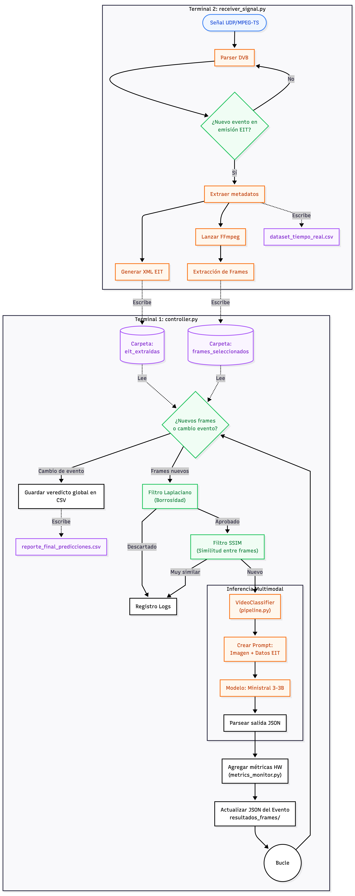

# Clasificador de Contenidos en Tiempo Real

Este proyecto es un sistema asíncrono que ingiere señales de televisión en vivo (MPEG-TS por UDP), extrae sus metadatos (EIT) y frames, y utiliza un modelo de IA multimodal (`Ministral-3-3B`) para clasificar el tipo de programa emitido en tiempo real.

## Arquitectura y Flujo del Sistema

El sistema se divide en dos procesos independientes. El siguiente diagrama detalla la arquitectura y el procesado implementado:



**Leyenda de colores:**
* **Azul:** Punto de origen (Señal de entrada UDP/MPEG-TS).
* **Naranja:** Procesos de extracción, reensamblado de tablas DVB e inferencia de la IA.
* **Verde:** Puntos de control de flujo y filtrado (detección de emisión, umbrales Laplaciano y SSIM).
* **Violeta:** Outputs y archivos generados por el sistema. 
    * **Archivos `.xml`**: Contienen los metadatos extraídos de la tabla EIT para cada evento. Incluye el título del programa, descripción extendida, horario y calificación por edades en BRUTO.
    * **Archivos `.jpg`**: Son los frames extraídos del flujo de vídeo original mediante FFmpeg.
    * **Archivos `.csv`**: Se generan dos archivos independientes:
        1. `dataset_tiempo_real.csv`: Un registro bruto que anota todo lo que se captura (evento, horario, duración y la categoría original dada por el radiodifusor).
        2. `reporte_final_predicciones.csv`: El informe de resultados finales dados por el sistema. Incluye información sobre el número de frames analizados, la predicción final de MLLM, y los diferentes valores establecidos para los umbrales.
    * **Archivos `.json`**: Archivos con la información detallada por evento a nivel de inferencia. Contienen el análisis exhaustivo frame a frame, incluyendo la predicción del MLLM, su porcentaje de confianza, la justificación de la decisión (_reasoning_) y métricas de rendimiento del hardware
* **Blanco/Negro:** Acciones rutinarias y bucles.


## Requisitos Previos

* Python 3.10+
* FFmpeg instalado en el sistema operativo.
* Dependencias de Python:
  ```
  pip install torch torchvision transformers pillow opencv-python scikit-image psutil pynvml pyRAPL
  ```
* En entornos Intel, es necesario habilitar los permisos de lectura ejecutando previamente el comando: `sudo chmod -R a+r /sys/class/powercap/intel-rapl`


## Ejecución del Sistema (2 TERMINALES)

El sistema está diseñado de forma desacoplada, por lo que **es obligatorio ejecutar dos procesos en terminales independientes**. 


### Paso 1. Terminal 1: Iniciar el Controlador 
Abre una terminal y ejecuta el siguiente comando. Este proceso se quedará en bucle infinito esperando a que lleguen nuevos frames y metadatos generados por el receptor. Es recomendado ejecutar primero este comando para que el controlador se quede "escuchando" antes de iniciar la recepción de la señal.
```
python controller.py
```

Adicionalmente y de manera opcional, se pueden integrar diferentes modos de configuración y de organización de carpetas. 
Los umbrales del filtrado se puede modificar, utilizando:

* **`--ssim-threshold` :** Umbral de similitud (SSIM). Mide la similitud entre el frame de referencia (en este caso, el analizado previamente), y el actual. Preestablecido en 0,6.
* **`--laplacian-min` :** Umbral mínimo de Laplaciano. Permite eliminar imágenes sin contenido estructural útil, como imágenes en negro o con figuras irrelevantes (como logos grandes). Preestablecido en 70.
* **`--laplacian-max` :** Umbral máximo de Laplaciano. Permite eliminar aquellos frames con exceso de altas frecuencias, debido a la captura sobre secuencias con alto movimiento que han perdido información útil. Preestablecido en 1500.

### Paso 2. Terminal 2: Iniciar la Ingesta de Señal
En una **nueva ventana de terminal** se sintoniza el flujo UDP. En cuanto detecte un programa en emisión, comenzará el proceso de extracción de datos y de frames (a partir del comando FFMPEG).
Para realizar este ejecución, es obligatorio la inclusión de la dirección y el puerto, y la duración total de la captura (en segundos). 

```
python receiver_signal.py --record-ip udp://X.X.X.X:YYYY --record-seconds 3600
```

Adicionalmente y de manera opcional, se pueden integrar diferentes modos de configuración como la estrategia de extracción de frames, el intervalo temporal entre extracciones, o la carpeta de almacenamiento de estos.

## Estructura de Salida 

A medida que el sistema avanza, generará automáticamente un árbol de archivos. Cabe destacar que el sistema produce **dos archivos CSV distintos**, cada uno con un propósito específico:

1. **Outputs de Ingesta:**
   * `RESULTADOS_MUX/frames_seleccionados/`: Imágenes (.jpg) extraídas, organizadas por servicio y evento.
   * `RESULTADOS_MUX/eit_extraidas/`: Metadatos de la guía (EIT) de cada programa en formato XML.
   * `RESULTADOS_MUX/dataset_tiempo_real.csv`: Registro bruto de ingesta. Anota todos los eventos detectados , sus marcas de tiempo y la categoría original de la etiqueta  DVB.
     
2. **Outputs del Controlador:**
   * `RESULTADOS_MUX/reporte_final_predicciones.csv`: Resumen inteligente. Contiene la categoría ganadora calculada por el MLLM tras analizar el programa emitido. Incluye además el número de frames analizados y los umbrales establecidos en esa ejecución.
   * `resultados_frames/`: Archivos JSON con la clasificación detallada frame a frame (voto del MLLM, nivel de confianza, razonamiento y métricas de consumo de Hardware).
   * `logs/`: Archivos de depuración (`video_classifier.log`) y registro de latencias puras (`latency.log`).
